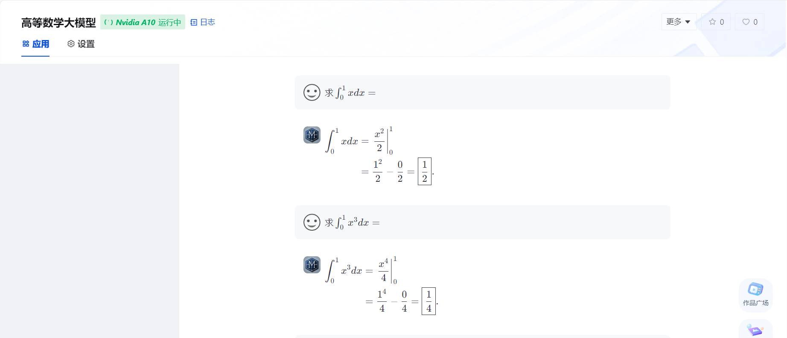

# AMchat 高等数学大模型
<div align="center">


  <div> </div>
  <div align="center">
    <b><font size="5">AMchat</font></b>
    <div> </div>
  </div>

[](./LICENSE)
[](https://github.com/internLM/OpenCompass/)

[🤗HuggingFace]() | [](https://openxlab.org.cn/models/detail/youngdon/AMchat) | [ ModelScope](https://www.modelscope.cn/models/yondong/AMchat/summary)

[](https://openxlab.org.cn/apps/detail/youngdon/AMchat) |  [🆕Update News](#-news) | [🤔Reporting Issues](https://github.com/AXYZdong/AMchat/issues)

[English](./README.md) | [简体中文](./README_zh-CN.md)
</div>


## 📖 简介

AM (Advanced Mathematics) chat 是一个集成了数学知识和高等数学习题及其解答的大语言模型。该模型使用 Math 和高等数学习题及习题解析融合数据集，基于internlm2-math-7B模型，通过 xtuner 微调，专门设计用于解答研究生入学考试（考研）数学题目。

如果你觉得这个项目对你有帮助，欢迎 ⭐ Star，让更多的人发现它！


## 🚀 NEWS

- 2024.2.1 AMchat第一版部署上线 https://openxlab.org.cn/apps/detail/youngdon/AMchat 🚀


## 🛠️ 使用方法

### 环境搭建

1. clone 本项目

```bash
git clone https://github.com/AXYZdong/AMchat.git
cd AMchat
```

2. 创建虚拟环境

```bash
conda env create -f environment.yml
conda activate AMchat
pip install -r requirements-raw.txt
```

### 微调

1. 准备配置文件

```bash
# 列出所有内置配置
xtuner list-cfg

mkdir -p /root/math/data
mkdir /root/math/config && cd /root/math/config

xtuner copy-cfg internlm2_chat_7b_qlora_oasst1_e3 .
```

2. 模型下载

```bash
mkdir -p /root/math/model
```
`download.py`

```python
import torch
from modelscope import snapshot_download, AutoModel, AutoTokenizer
import os
model_dir = snapshot_download('Shanghai_AI_Laboratory/internlm2-math-7b', cache_dir='/root/math/model')
```


3. 修改配置文件

```bash
cd /root/math/config
vim internlm_chat_7b_qlora_oasst1_e3_copy.py
```

```python
# 修改模型为本地路径
- pretrained_model_name_or_path = 'internlm/internlm-chat-7b'
+ pretrained_model_name_or_path = './internlm2-math-7b'

# 修改训练数据集为本地路径
- data_path = 'timdettmers/openassistant-guanaco'
+ data_path = './data'
```

4. 开始微调

```bash
xtuner train /root/math/config2/internlm2_chat_7b_qlora_oasst1_e3_copy.py
```

### 部署

1. PTH 模型转换为 HuggingFace 模型

```bash
xtuner convert pth_to_hf ./internlm2_chat_7b_qlora_oasst1_e3_copy.py \
                         ./work_dirs/internlm2_chat_7b_qlora_oasst1_e3_copy/epoch_3.pth \
                         ./hf
```

2. HuggingFace 模型合并到大语言模型
```bash
export MKL_SERVICE_FORCE_INTEL=1
export MKL_THREADING_LAYER='GNU'

# 原始模型参数存放的位置
export NAME_OR_PATH_TO_LLM=/root/math/model/Shanghai_AI_Laboratory/internlm2-math-7b

# Hugging Face格式参数存放的位置
export NAME_OR_PATH_TO_ADAPTER=/root/math/config/hf

# 最终Merge后的参数存放的位置
mkdir /root/math/config/work_dirs/hf_merge
export SAVE_PATH=/root/math/config/work_dirs/hf_merge

# 执行参数Merge
xtuner convert merge \
    $NAME_OR_PATH_TO_LLM \
    $NAME_OR_PATH_TO_ADAPTER \
    $SAVE_PATH \
    --max-shard-size 2GB
```

3. Demo

```bash
streamlit run web_demo.py --server.address=0.0.0.0 --server.port 7860
```

<details>
<summary> 演示 </summary>

<p align="center">
    
</p>

</details>

## 👥 贡献者

<a href="https://github.com/AXYZdong/AMchat/graphs/contributors">
  
</a>

## 💕 致谢

- [**InternLM-tutorial**](https://github.com/InternLM/tutorial)

- [**InternStudio**](https://studio.intern-ai.org.cn/)

- [**xtuner**](https://github.com/InternLM/xtuner)

感谢上海人工智能实验室推出的书生·浦语大模型实战营，为我们的项目提供宝贵的技术指导和强大的算力支持。


## 开源许可证

该项目采用 [Apache License 2.0 开源许可证](https://github.com/AXYZdong/AMchat/blob/main/LICENSE) 同时，请遵守所使用的模型与数据集的许可证。
