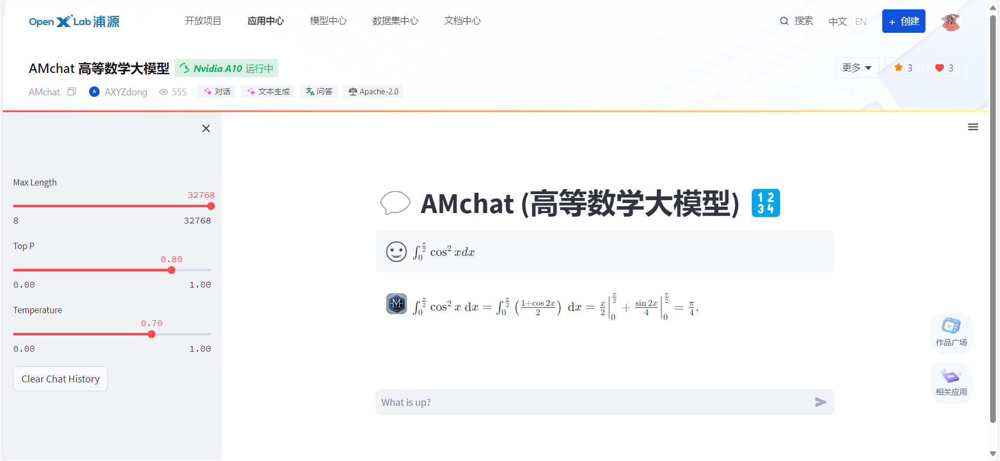
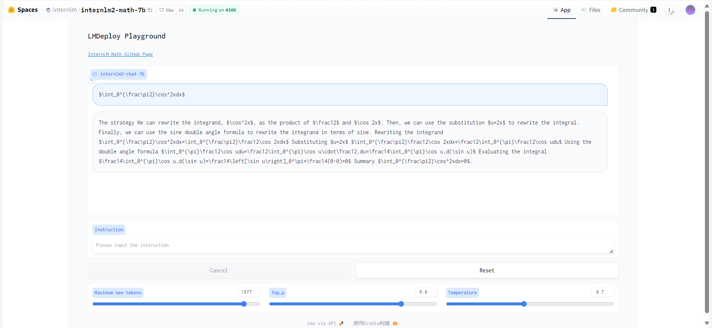

# AMchat
<div align="center">


  <div align="center">
    <p><b><font size="5">AMchat</font></b></p>
  </div>

[![license][license-image]][license-url]
[![evaluation][evaluation-image]][evaluation-url]

[🤗HuggingFace][HuggingFace_Model-url] | [![OpenXLab_Model][OpenXLab_Model-image]][OpenXLab_Model-url] | [ ModelScope][ModelScope-url]

[![OpenXLab_App][OpenXLab_App-image]][OpenXLab_App-url] | [🆕Update News](#-news) | [🤔Reporting Issues][Issues-url] 丨 [![bilibili][bilibili-image]][bilibili-url]

[English](./README_en-US.md) | [简体中文](./README.md)


[license-image]: ./assets/license.svg
[evaluation-image]: ./assets/compass_support.svg
[OpenXLab_Model-image]: https://cdn-static.openxlab.org.cn/header/openxlab_models.svg
[OpenXLab_App-image]: https://cdn-static.openxlab.org.cn/app-center/openxlab_app.svg
[bilibili-image]: https://img.shields.io/badge/AMchat-bilibili-%23fb7299

[license-url]: ./LICENSE
[evaluation-url]: https://github.com/internLM/OpenCompass/
[HuggingFace_Model-url]: https://huggingface.co/axyzdong/AMchat
[OpenXLab_Model-url]: https://openxlab.org.cn/models/detail/youngdon/AMchat
[ModelScope-url]: https://www.modelscope.cn/models/yondong/AMchat/summary
[OpenXLab_App-url]: https://openxlab.org.cn/apps/detail/youngdon/AMchat
[bilibili-url]: https://www.bilibili.com/video/BV14v421i7So/
[Issues-url]: https://github.com/AXYZdong/AMchat/issues

</div>

## 📝 Contents

- [📖 Introduction](#-introduction)
- [🚀 News](#-news)
- [🛠️ Usage](#%EF%B8%8F-usage)
  * [Quick Start](#quick-start)
  * [Retraining](#retraining)
    + [Environment Setup](#environment-setup)
    + [XTuner Fine-tuning](#xtuner-fine-tuning)
    + [OpenXLab Deployment](#openxlab-deployment)
    + [LMDeploy Quantization](#lmdeploy-quantization)
    + [OpenCompass Evaluation](#opencompass-evaluation)
    + [LMDeploy & OpenCompass Quantization and Evaluation](#lmdeploy--opencompass-quantization-and-evaluation)
- [💕 Acknowledgements](#-acknowledgements)
- [🖊️ Citation](#%EF%B8%8F-citation)
- [License](#license)


## 📖 Introduction

AM (Advanced Mathematics) Chat is a large-scale language model that integrates mathematical knowledge, advanced mathematics problems, and their solutions. This model utilizes a dataset that combines Math and advanced mathematics problems with their analyses. It is based on the InternLM2-Math-7B model and has been fine-tuned with xtuner, specifically designed to solve advanced mathematics problems.

If you find this project helpful, feel free to ⭐ Star it and help more people discover it!

<p align="center">
    
</p>

## 🚀 News

[2024.03.14] The model has been uploaded to HuggingFace.

[2024.03.08] The README was enhanced with the addition of a table of contents and a technical roadmap. Additionally, a new document, README_en-US.md, was created.

[2024.02.06] Docker deployment is now supported.

[2024.02.01] The first version of AMchat is deployed online at https://openxlab.org.cn/apps/detail/youngdon/AMchat 🚀


## 🛠️ Usage

### Quick Start

1. Download the Model

<details>
<summary>From ModelScope</summary>

Refer to [Downloading Models](https://www.modelscope.cn/docs/%E6%A8%A1%E5%9E%8B%E7%9A%84%E4%B8%8B%E8%BD%BD).

```bash
pip install modelscope
```

```python
from modelscope.hub.snapshot_download import snapshot_download
model_dir = snapshot_download('yondong/AMchat', cache_dir='./')
```

</details>

<details>
<summary>From OpenXLab</summary>

Refer to [Downloading Models](https://openxlab.org.cn/docs/models/%E4%B8%8B%E8%BD%BD%E6%A8%A1%E5%9E%8B.html).

```bash
pip install openxlab
```

```python
from openxlab.model import download
download(model_repo='youngdon/AMchat', 
        model_name='AMchat', output='./')
```

</details>

2. Local Deployment

```bash
git clone https://github.com/AXYZdong/AMchat.git 
python start.py
```

3. Docker Deployment

```bash
docker run -t -i --rm --gpus all -p 8501:8501 guidonsdocker/amchat:latest bash start.sh
```

### Retraining

#### Environment Setup

1. Clone this project

```bash
git clone https://github.com/AXYZdong/AMchat.git 
cd AMchat
```

2. Create a virtual environment

```bash
conda env create -f environment.yml
conda activate AMchat
pip install -r requirements-raw.txt
```

#### XTuner Fine-tuning

1. Prepare configuration files

```bash
# List all built-in configurations
xtuner list-cfg

mkdir -p /root/math/data
mkdir /root/math/config && cd /root/math/config

xtuner copy-cfg internlm2_chat_7b_qlora_oasst1_e3 .
```

2. Model Download

```bash
mkdir -p /root/math/model
```

`download.py`

```python
import torch
from modelscope import snapshot_download, AutoModel, AutoTokenizer
import os
model_dir = snapshot_download('Shanghai_AI_Laboratory/internlm2-math-7b', cache_dir='/root/math/model')
```

3. Modify configuration files

```bash
cd /root/math/config
vim internlm_chat_7b_qlora_oasst1_e3_copy.py
```

```python
# Change the model to local path
- pretrained_model_name_or_path = 'internlm/internlm-chat-7b'
+ pretrained_model_name_or_path = './internlm2-math-7b'

# Change the training dataset to local path
- data_path = 'timdettmers/openassistant-guanaco'
+ data_path = './data'
```

4. Start fine-tuning

```bash
xtuner train /root/math/config2/internlm2_chat_7b_qlora_oasst1_e3_copy.py
```

5. Convert PTH model to HuggingFace model

```bash
xtuner convert pth_to_hf ./internlm2_chat_7b_qlora_oasst1_e3_copy.py \
                         ./work_dirs/internlm2_chat_7b_qlora_oasst1_e3_copy/epoch_3.pth \
                         ./hf
```

6. Merge HuggingFace model into a large language model

```bash
export MKL_SERVICE_FORCE_INTEL=1
export MKL_THREADING_LAYER='GNU'

# Original model parameter location
export NAME_OR_PATH_TO_LLM=/root/math/model/Shanghai_AI_Laboratory/internlm2-math-7b

# Hugging Face format parameter location
export NAME_OR_PATH_TO_ADAPTER=/root/math/config/hf

# Final merged parameter location
mkdir /root/math/config/work_dirs/hf_merge
export SAVE_PATH=/root/math/config/work_dirs/hf_merge

# Execute parameter merge
xtuner convert merge \
    $NAME_OR_PATH_TO_LLM \
    $NAME_OR_PATH_TO_ADAPTER \
    $SAVE_PATH \
    --max-shard-size 2GB
```

7. Demo

```bash
streamlit run web_demo.py --server.address=0.0.0.0 --server.port 7860
```

#### OpenXLab Deployment

To deploy AMchat on OpenXLab, simply fork this repository and then create a new project on OpenXLab. Associate the forked repository with the newly created project, and you will be able to deploy AMchat on OpenXLab.

<p align="center">
    
</p>

- AMchat and InternLM2-Math-7B answer the same integral problem.
  AMchat answers correctly, while InternLM2-Math-7B answers incorrectly.

<p align="center">
    
    
</p>

#### LMDeploy Quantization
- First, install LMDeploy

```shell
pip install -U lmdeploy
```

- Then, convert the model to `turbomind` format

> --dst-path: You can specify the storage location for the converted model.

```shell
lmdeploy convert internlm2-chat-7b  Model address to be converted --dst-path Converted model address
```

- LMDeploy Chat

```shell
lmdeploy chat turbomind Converted turbomind model address
```

#### OpenCompass Evaluation
- Install OpenCompass

```shell
git clone https://github.com/open-compass/opencompass 
cd opencompass
pip install -e .
```

- Download and unzip the dataset

```shell
cp /share/temp/datasets/OpenCompassData-core-20231110.zip /root/opencompass/
unzip OpenCompassData-core-20231110.zip
```

- Start evaluation!

```shell
python run.py \
    --datasets math_gen \
    --hf-path Model address \
    --tokenizer-path Tokenizer address \
    --tokenizer-kwargs padding_side='left' truncation='left' trust_remote_code=True \
    --model-kwargs device_map='auto' trust_remote_code=True \
    --max-seq-len 2048 \
    --max-out-len 16 \
    --batch-size 2  \
    --num-gpus 1 \
    --debug
```

#### LMDeploy & OpenCompass Quantization and Evaluation

<details>
<summary><strong> W4 </strong> Quantization Evaluation </summary>

- `W4` Quantization
```shell
lmdeploy lite auto_awq Model address to be quantized --work-dir Quantized model address
```

- Convert to `TurbMind`
```shell
lmdeploy convert internlm2-chat-7b Quantized model address --model-format awq --group-size 128 --dst-path Converted model address
```

- Evaluation `config` writing
```python
from mmengine.config import read_base
from opencompass.models.turbomind import TurboMindModel

with read_base():
 # choose a list of datasets   
 from .datasets.ceval.ceval_gen import ceval_datasets 
 # and output the results in a chosen format
#  from .summarizers.medium import summarizer

datasets = [*ceval_datasets]

internlm2_chat_7b = dict(
     type=TurboMindModel,
     abbr='internlm2-chat-7b-turbomind',
     path='Converted model address',
     engine_config=dict(session_len=512,
         max_batch_size=2,
         rope_scaling_factor=1.0),
     gen_config=dict(top_k=1,
         top_p=0.8,
         temperature=1.0,
         max_new_tokens=100),
     max_out_len=100,
     max_seq_len=512,
     batch_size=2,
     concurrency=1,
     #  meta_template=internlm_meta_template,
     run_cfg=dict(num_gpus=1, num_procs=1),
)
models = [internlm2_chat_7b]

```

- Start evaluation!
```shell
python run.py configs/eval_turbomind.py -w Specify the result save path
```

</details>

<details>
<summary><strong> KV Cache </strong> Quantization Evaluation</summary>

- Convert to `TurbMind`
```shell
lmdeploy convert internlm2-chat-7b Model path --dst-path Converted model path
```

- Calculate and obtain quantization parameters
```shell
# Calculate
lmdeploy lite calibrate Model path --calib-dataset 'ptb' --calib-samples 128 --calib-seqlen 2048 --work-dir Parameter save path
# Get quantization parameters
lmdeploy lite kv_qparams Parameter save path Converted model path/triton_models/weights/ --num-tp 1
```

- Change `quant_policy` to `4`, change the path in the above `config`
- Start evaluation!
```shell
python run.py configs/eval_turbomind.py -w Result save path
```

</details>

- Result files and evaluation datasets can be obtained in the same directory [results](./results).

## 💕 Acknowledgements


[**InternLM-tutorial**](https://github.com/InternLM/tutorial)

[**InternStudio**](https://studio.intern-ai.org.cn/)

[**xtuner**](https://github.com/InternLM/xtuner)

[**InternLM-Math**](https://github.com/InternLM/InternLM-Math)


<a href="https://github.com/AXYZdong/AMchat/graphs/contributors">
  
</a>

## 🖊️ Citation

```bibtex
@misc{2024AMchat,
    title={AMchat: A large language model integrating advanced math concepts, exercises, and solutions},
    author={AMchat Contributors},
    howpublished = {\url{https://github.com/AXYZdong/AMchat}},
    year={2024}
}
```

## License
This project is released under the [Apache License 2.0.](https://github.com/InternLM/xtuner/blob/main/LICENSE) Please also adhere to the Licenses of models and datasets being used.
