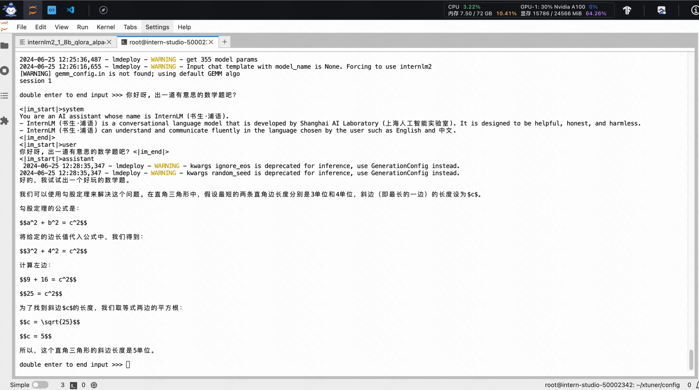

# LMDeploy 模型量化与部署优化指南：以 InternLM2-Math-Plus-7B 为例

本指南将详细介绍如何使用 LMDeploy 对 InternLM2-Math-Plus-7B 模型进行量化和部署优化。通过这个过程，我们可以显著提高模型的推理速度和内存效率。
本文档参考 LMDeploy 重要官方教程 [link](https://github.com/InternLM/Tutorial/blob/camp2/lmdeploy/README.md#4lmdeploy%E6%9C%8D%E5%8A%A1serve)

## 1. 环境准备

首先，在 InternStudio 平台上创建一个开发机，选择合适的镜像和 GPU 资源。

1. 创建并激活 conda 环境
2. 安装 LMDeploy：

```bash
pip install lmdeploy
```

## 2. 下载模型

使用 ModelScope 下载 InternLM2-Math-Plus-7B 模型：

```python
import torch
import os
from modelscope import snapshot_download, AutoModel, AutoTokenizer

model_dir = snapshot_download('Shanghai_AI_Laboratory/internlm2-math-plus-7b', cache_dir='/root/ft-math',
                              revision='master')
print(model_dir)
```

## 3. W4A16 量化

使用 LMDeploy 的 `lite` 命令对模型进行 W4A16 量化：

```bash
lmdeploy lite auto_awq \
    /root/ft-math/Shanghai_AI_Laboratory/internlm2-math-plus-7b \
    --calib-dataset 'ptb' \
    --calib-samples 128 \
    --calib-seqlen 1024 \
    --w-bits 4 \
    --w-group-size 128 \
    --work-dir /root/ft-math/Shanghai_AI_Laboratory/internlm2-math-plus-7b-4bit
```

这个命令会将模型量化为 4 位权重（W4），并将量化后的模型保存在指定目录。

## 4. 启动 API 服务器

使用 `lmdeploy serve api_server` 命令启动 API 服务器：

```bash
lmdeploy serve api_server \
    /root/ft-math/Shanghai_AI_Laboratory/internlm2-math-plus-7b-4bit \
    --model-format awq \
    --cache-max-entry-count 0.4 \
    --server-name 0.0.0.0 \
    --server-port 23333 \
    --tp 1
```

参数说明：

- `--model-format awq`：指定使用 AWQ 量化格式
- `--cache-max-entry-count 0.4`：设置 KV Cache 占用比例为 0.4
- `--server-name 0.0.0.0`：允许外部访问
- `--server-port 23333`：设置服务端口
- `--tp 1`：设置张量并行度为 1

启动服务器后，请保持终端窗口打开。

## 5. 启动命令行客户端

在新的终端窗口中，运行以下命令启动命令行客户端：

```bash
lmdeploy serve api_client http://localhost:23333
```

这将连接到我们刚刚启动的 API 服务器。

## 6. 与模型交互

现在您可以通过命令行客户端与 InternLM2-Math-Plus-7B 模型进行对话，利用其强大的数学计算和知识解释能力。

## 7. （可选）直接启动聊天界面

如果您想跳过 API 服务器和客户端设置，直接与模型对话，可以使用以下命令：

```bash
lmdeploy chat /root/ft-math/Shanghai_AI_Laboratory/internlm2-math-plus-7b-4bit --model-format awq --cache-max-entry-count 0.5
```

这将启动一个交互式的聊天界面，您可以直接与量化后的模型对话。



## 结语和讨论

通过以上步骤，我们成功地使用 LMDeploy 对 InternLM2-Math-Plus-7B 模型进行了量化和部署优化。这个过程不仅减少了模型的内存占用，还提高了推理速度。量化和
KV Cache 优化是处理大型语言模型部署挑战的有效方法。

在实际应用中，您可能需要根据具体的硬件条件和性能需求调整相关参数。不断实验和优化是找到最佳配置的关键。在工程实践中,量化和KV
Cache的效果非常显著。以我们部署的一个100亿参数的语言模型为例,单纯使用FP16精度,推理速度只有10个token/秒;而在进行INT8量化和KV
Cache优化后,速度提升到了100个token/秒,提升了10倍。这样的性能改进,对于实时对话、文本生成等应用场景,有着至关重要的意义。

1. 为什么需要量化和KV Cache？ 量化通过降低模型权重的精度，显著减少模型体积和访存量，缓解访存瓶颈。KV
   Cache通过缓存Transformer的Key和Value矩阵，避免重复计算，节省计算资源。这两种技术分别针对了模型部署中的两个主要问题：访存瓶颈和计算资源限制。
2. 量化明明增加了计算步骤，为什么还能提高推理效率？
   虽然量化引入了一些额外的计算步骤（如量化和反量化），但它减少的访存量远大于增加的计算量。在现代计算机体系结构中，访存往往是性能的主要瓶颈，而不是计算。因此，量化通过大幅降低访存量，可以显著提高推理效率，这种提升远大于量化引入的计算开销。
3. 为什么推理时会有访存瓶颈？为什么不把权重直接存在显存里？
   大模型的权重体积远大于单个GPU的显存容量，因此无法完全存储在显存中。在推理过程中，GPU的计算速度远快于内存的访问速度，导致访存瓶颈。需要从算法和硬件两个层面优化访存，量化是一种有效的算法手段。
4. 量化真的减少了计算量吗？
   严格来说，量化并不直接减少矩阵乘法或卷积等基础运算的计算量，因为这些运算通常是在高精度下进行的。量化的主要优势在于减少了访存量，特别是权重的读取量，从而缓解了访存瓶颈。如果能利用专门的低精度计算单元（如NVIDIA
   Tensor Core），也可以提高计算效率。


