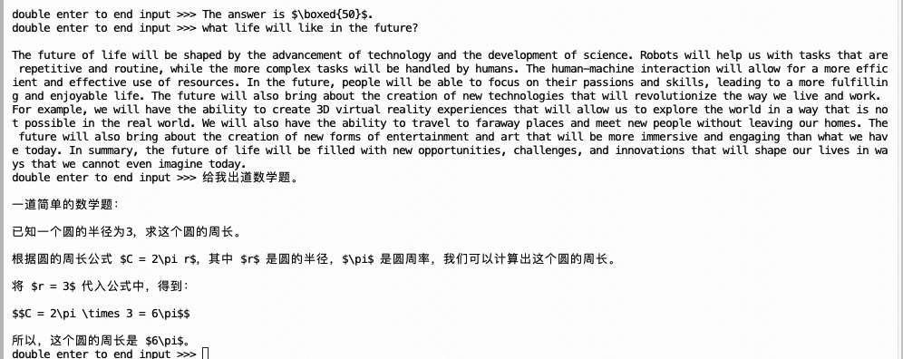

# LMDeploy 量化

## Background: 大模型推理的挑战

在部署大规模语言模型时,我们面临着两大挑战:**访存瓶颈**和**计算资源限制**。

访存瓶颈是指,模型的权重数据量远大于GPU的显存容量,需要在内存和显存之间频繁地交换数据,而内存的访问速度远慢于GPU的计算速度,成为了性能的主要限制因素。
计算资源限制是指,单个GPU的算力难以满足超大模型的计算需求,需要采用模型并行等技术,将模型切分到多个GPU上进行计算。

[//]: # (![img.png]&#40;images/img.png&#41;)

量化是应对访存瓶颈的有效武器。它通过将模型权重从32位浮点数(FP32)量化到8位整数(INT8)甚至4位整数(INT4)
,可以大大减少模型的内存占用和访存量。以INT4量化为例,它可以将模型体积压缩到原来的1/8,将访存量减少到1/4。这意味着,在相同的硬件条件下,我们可以部署更大的模型,或者以更低的延迟实现推理。

[//]: # (![img_1.png]&#40;images/img_1.png&#41;)


量化的基本流程如下:

1. 中心点（ZP）的计算 $ZP = \frac{\text{min} + \text{max}}{2}$

2. 缩放因子（S）的计算 $S = \frac{\text{max} - \text{min}}{255}$

3. 量化值（q）的计算 $q = \text{round}\left(\frac{-ZP}{S}\right)$

4. 反量化, 最终值（f）的计算 $f = q \times S + ZP$

当然,量化也不是免费的午餐。它不可避免地引入了一些精度损失。但在超大规模的模型中,这种损失往往可以忽略不计。我们可以通过量化感知训练、混合精度量化等技术,进一步减少量化带来的精度损失。总的来说,量化在访存优化上的收益,远大于其精度损失的代价。
除了量化,KV
Cache是另一种提速的利器,特别是对于Transformer类模型。在Transformer的推理过程中,每一层都要计算Key和Value矩阵,而这些矩阵在序列的不同位置是相同的。如果每次都重新计算这些矩阵,就会有大量的重复计算,浪费宝贵的算力。20B模型在
batch size 为 16，输入序列为 512 tokens，输出 32 tokens 的情况下，KV缓存会占用约10.3GB的显存.

[//]: # (![img_2.png]&#40;images/img_2.png&#41;)

KV Cache的思路很简单:
将每一层的Key和Value矩阵缓存下来,在后续的计算中直接读取,避免重复计算。这就像是为Transformer建立了一个专属的"查表"
功能,大大节省了计算量。当然,缓存也需要占用宝贵的显存资源。我们需要根据具体的模型和硬件,合理设置缓存的大小,在速度和内存占用之间找到最佳的平衡点。

在工程实践中,量化和KV Cache的效果非常显著。以我们部署的一个100亿参数的语言模型为例,单纯使用FP16精度,推理速度只有10个token/秒;而在进行INT8量化和KV
Cache优化后,速度提升到了100个token/秒,提升了10倍。这样的性能改进,对于实时对话、文本生成等应用场景,有着至关重要的意义。

1. 为什么需要量化和KV Cache？ 量化通过降低模型权重的精度，显著减少模型体积和访存量，缓解访存瓶颈。KV
   Cache通过缓存Transformer的Key和Value矩阵，避免重复计算，节省计算资源。这两种技术分别针对了模型部署中的两个主要问题：访存瓶颈和计算资源限制。
2. 量化明明增加了计算步骤，为什么还能提高推理效率？
   虽然量化引入了一些额外的计算步骤（如量化和反量化），但它减少的访存量远大于增加的计算量。在现代计算机体系结构中，访存往往是性能的主要瓶颈，而不是计算。因此，量化通过大幅降低访存量，可以显著提高推理效率，这种提升远大于量化引入的计算开销。
3. 为什么推理时会有访存瓶颈？为什么不把权重直接存在显存里？
   大模型的权重体积远大于单个GPU的显存容量，因此无法完全存储在显存中。在推理过程中，GPU的计算速度远快于内存的访问速度，导致访存瓶颈。需要从算法和硬件两个层面优化访存，量化是一种有效的算法手段。
4. 量化真的减少了计算量吗？
   严格来说，量化并不直接减少矩阵乘法或卷积等基础运算的计算量，因为这些运算通常是在高精度下进行的。量化的主要优势在于减少了访存量，特别是权重的读取量，从而缓解了访存瓶颈。如果能利用专门的低精度计算单元（如NVIDIA
   Tensor Core），也可以提高计算效率。

## 6 Steps for Deploying InternLM2-Math-Plus-7B

参考教程 [link](https://github.com/InternLM/Tutorial/tree/camp2/lmdeploy#3lmdeploy%E6%A8%A1%E5%9E%8B%E9%87%8F%E5%8C%96lite),
我们通过六个步骤,演示如何在InternStudio平台上部署一个量化优化的InternLM2-Math-Plus-7B模型API服务,并使用命令行客户端与之交互。详情参见 [link](https://swze06osuex.feishu.cn/docx/VS1Dd6QGvoBLLhxXB3zcVssInvc?from=from_copylink)

1. 在InternStudio平台上创建开发机,选择合适的镜像和GPU资源,进入开发机。创建并激活conda环境,安装lmdeploy。
2. 使用 ModelScope 下载模型 InternLM2-Math-Plus-7B.

```python
import torch
import os
from modelscope import snapshot_download, AutoModel, AutoTokenizer

model_dir = snapshot_download('Shanghai_AI_Laboratory/internlm2-math-plus-7b', cache_dir='/root/ft-math',
                              revision='master')
model_dir
```

3. 安装依赖库,然后使用lmdeploy lite指令对InternLM2-Math-Plus-7B模型进行W4A16量化。量化后的模型会保存在指定目录。

```bash
lmdeploy lite auto_awq \
   /root/ft-math/Shanghai_AI_Laboratory/internlm2-math-plus-7b \
  --calib-dataset 'ptb' \
  --calib-samples 128 \
  --calib-seqlen 1024 \
  --w-bits 4 \
  --w-group-size 128 \
  --work-dir /root/ft-math/Shanghai_AI_Laboratory/internlm2-math-plus-7b-4bit
```

4. 运行lmdeploy serve api_server指令,以API Server方式启动lmdeploy。指定使用量化后的模型,将KV
   Cache占用比例设置为0.4,配置服务器名称、端口号等参数。API服务器启动后请勿关闭终端窗口。

```bash
lmdeploy chat /root/ft-math/Shanghai_AI_Laboratory/internlm2-math-plus-7b-4bit --model-format awq --cache-max-entry-count 0.5
```

5. 运行lmdeploy serve api_client指令,启动命令行客户端并连接到API服务器。

```bash
lmdeploy serve api_client http://localhost:23333
```

通过以上步骤,即可在InternStudio平台上部署一个量化优化的InternLM2-Math-Plus-7B模型API服务,并使用命令行客户端与之交互,利用该模型强大的数学计算和数学知识解释能力。



## 补充说明: 环境配置

环境配置请参考 [link](https://github.com/InternLM/Tutorial/tree/camp2/lmdeploy#3lmdeploy%E6%A8%A1%E5%9E%8B%E9%87%8F%E5%8C%96lite)。
